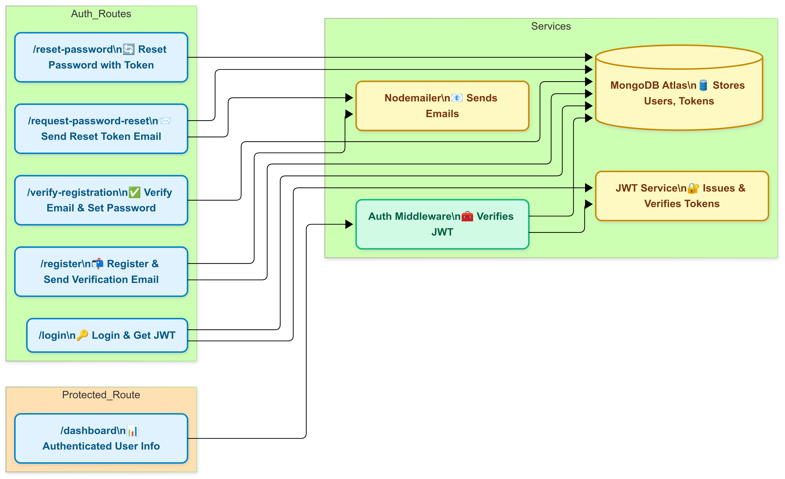

# 🔐 Secure Auth Backend

A secure, scalable, and testable backend application built with **Express.js** and **MongoDB Atlas**. Includes authentication with email-based verification, password reset, rate limiting, and unit testing.

---

## 🚀 Features

- ✅ User Registration with Email Verification (Nodemailer)
- 🔐 Secure Login with JWT
- ♻️ Email-based Password Reset Flow
- ⚙️ Rate Limiting with `express-rate-limit`
- 🧪 Unit Testing with Jest + Supertest
- ⛔ Prevents Simultaneous Logins
- 🛡️ Environment Variables via `.env`
- 🌐 MongoDB Atlas Integration

---

## 📦 Tech Stack

- Node.js
- Express.js
- MongoDB (Atlas)
- Mongoose
- Nodemailer (Gmail App Password)
- dotenv
- express-rate-limit
- Jest + Supertest

---

## 🛠 Setup Instructions

### 1. Clone the Repo
```bash
git clone https://github.com/Hackur45/secure-backend.git
cd secure-backend
```

### 2. Install Dependencies

```bash
npm install
```

### 3. Create `.env` File

```env
PORT=5500
MONGO_URI=your_mongo_connection_string
JWT_SECRET=your_jwt_secret
EMAIL_USER=your_email@gmail.com
EMAIL_PASS=your_app_password
```

### 4. Start Server

```bash
npm start
```

Server runs on `http://localhost:5500`

---

## 📮 API Endpoints and Utilities

### 🔹 POST /api/register
Registers a new user by accepting an email address. Sends a verification email with a token to confirm the user's email address.  
*See Postman Screenshot:*

### 🔹 POST /api/verify-registration
Verifies the user's email using the token sent via email and sets the user's password. Marks the account as verified.  
*See Postman Screenshot:*


### 🔹 POST /api/login
Authenticates a user with email and password. Returns a JWT token upon successful login for session management.  
*See Postman Screenshot:*

### 🔹 POST /api/request-password-reset
Initiates a password reset by generating a reset token and sending a reset email to the user.  
*See Postman Screenshot:*

### 🔹 POST /api/reset-password
Resets the user's password using the valid reset token and new password provided.  
*See Postman Screenshot:*

### 🔒 GET /api/dashboard
A protected route that requires a valid Bearer token (JWT). Returns a welcome message and the authenticated user's ID.  
*See Postman Screenshot:*

---

## 🏗 Backend Architecture



The backend architecture includes:
- Express.js server handling API requests.
- MongoDB Atlas for data persistence.
- JWT-based authentication for secure access.
- Email services for verification and password reset.
- Middleware for authentication and rate limiting.

---

## 🧪 Running Tests

```bash
npm test
```

Runs unit tests using Jest + Supertest.

---

## ⚠️ Notes

* Use Gmail App Passwords (not your main password) for Nodemailer.
* Reset token and verification token are time-limited and secure.
* Rate limiting protects against abuse on login and registration routes.


Please refer the  `Postman teting Routes.txt` file for more clarification about the routes.

## 🙌 Contribute

As always, I'm a bit lazy when it comes to the frontend — so if you're up for it, **feel free to contribute**! I'd love to see a minimal UI built for these authentication routes.

This repository is **MIT licensed** and open to all.  
Pull requests are welcome!

Happy Coding! 😀
